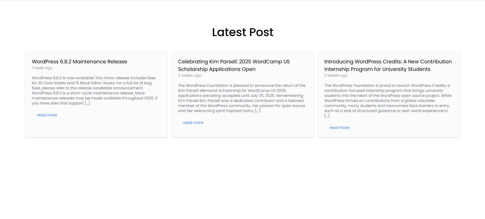
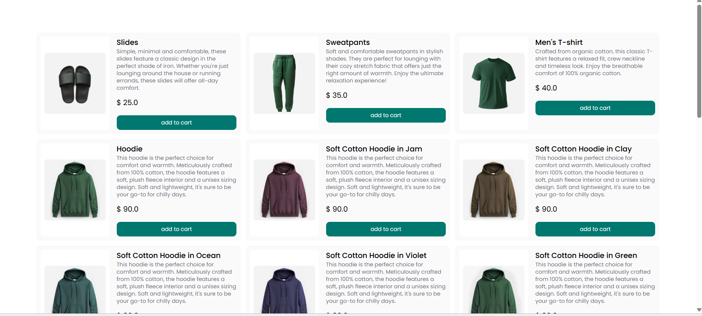

# 🧩 Mini Brand Dashboard Widget

This is a 2-hour technical integration task built to demonstrate:
- WordPress REST API integration
- Shopify product rendering using mock data
- Clean UI using Tailwind CSS

---

## 🔧 Setup Instructions

1. **Clone the Repository**
   ```bash
   git clone https://github.com/yourusername/brand-dashboard-widget.git
   cd brand-dashboard-widget

2. **Open the Project**
   No backend setup required. Open `index.html` directly in your browser.

3. **Folder Structure**

   ```
   /wordpress-integration/
     └── index.html
     └── script.js

   /shopify-integration/
     └── index.html
     └── script.js

   /php-api/
     └── info.php
   ```

---

## 🌐 API Integrations

### ✅ WordPress Integration

* **Source:**
  [https://wordpress.org/news/wp-json/wp/v2/posts](https://wordpress.org/news/wp-json/wp/v2/posts)

* **Functionality:**

  * Fetches and displays the latest 3 blog posts
  * Each post includes:

    * Title
    * Excerpt (first 100 characters)
    * Link to full post

### ✅ Shopify Integration

* **Mock Data Source:**
  [https://mock.shop/](https://mock.shop/)
  GraphQL Query used:


* **Functionality:**

  * Displays featured products:

    * Product title
    * Product image
    * Price

* **Integration Type:**
  Data fetched via `fetch()` using mocked API format from mock.shop.

---

## 🎨 Styling

* **Framework Used:** Tailwind CSS
* Applied to both WordPress and Shopify modules
* Responsive layout with card-based UI

---

## 💡 Assumptions Made

* No access to a real Shopify store or API keys, so mock.shop was used to simulate API response.
* WordPress blog posts are fetched from the official `wordpress.org/news` feed.
* No backend or database used — purely client-side render.

---

## 🖼️ Screenshots

> Example:
> 
> 

---

## 📌 Tech Stack

* HTML, JavaScript
* Tailwind CSS
* WordPress REST API
* Shopify Mock API (`mock.shop`)

---

## 📁 Future Improvements

* Use Laravel Blade templates to render these views dynamically
* Add pagination for blog posts and products
* Integrate real Shopify store with Storefront API and auth

---

## 👨‍💻 Developed By

**Firoz**
Email: [khanfiroz4045@gmail.com](mailto:khanfiroz4045@gmail.com)
Contact: +91 9821574580
